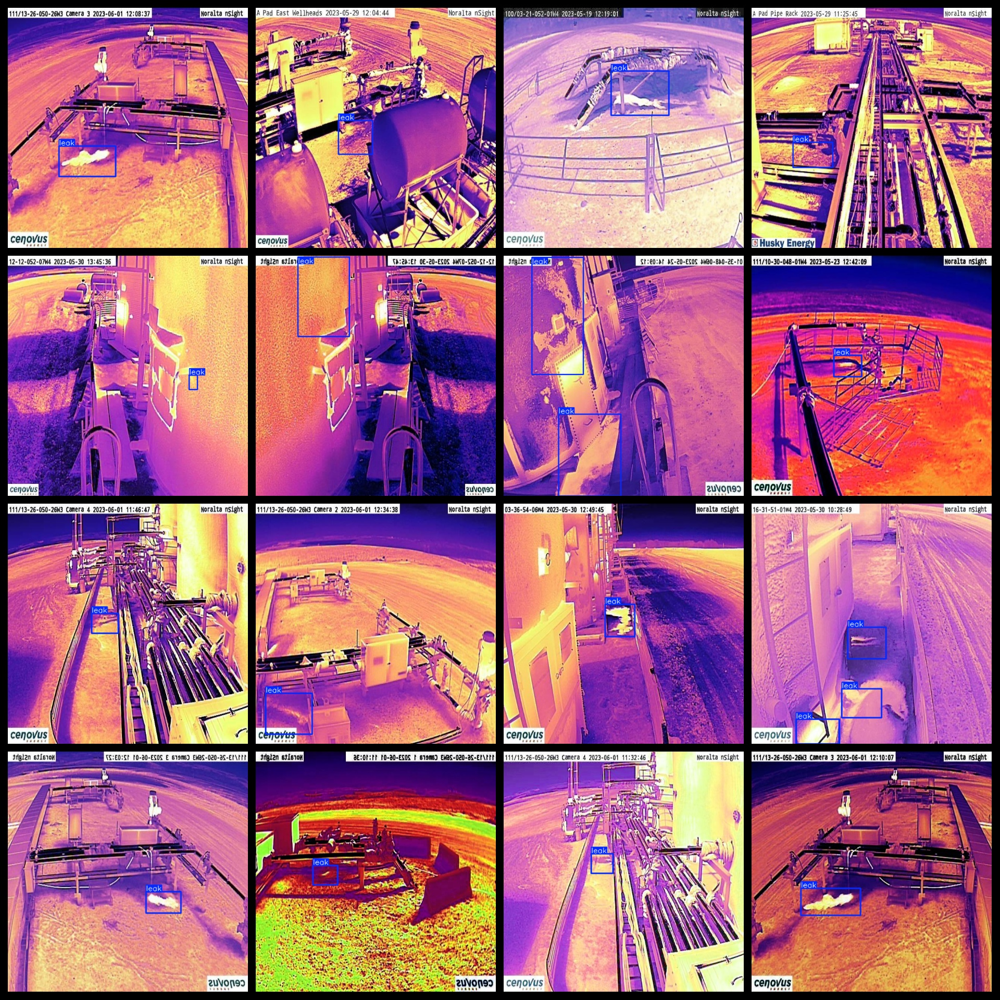
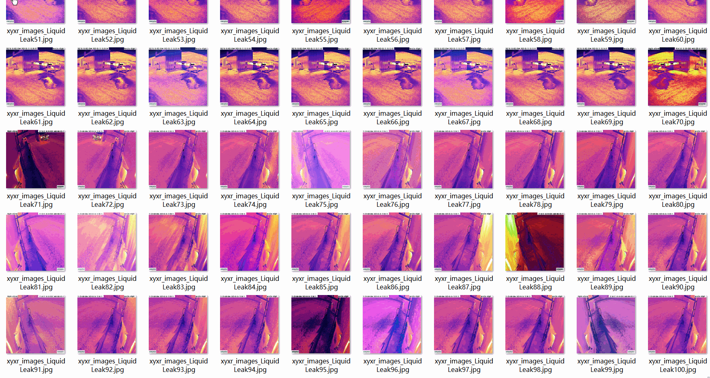

# Infrared Liquid drainage Leak Detection Dataset 2474 imagesVOC+YOLO format

Infrared Liquid Leak Detection Dataset 2474 sheets VOC + YOLO format

Dataset format: Pascal VOC format + YOLO format (the txt file does not contain the split path, it only contains jpg images and corresponding VOC format xml files and yolo format txt files)

Number of images (number of jpg files): 2474

Mark the number of XML files: 2474

Number of txt files: 2474

Number of categories: 1

The Github repository is: datasets_sl

Annotation class names: ["leak"]

Number of boxes labeled in each category:

The number of leaks is 5816.

Total frames: 5816

Number of images per category:

Leaking image count = 2474

Image resolution: 640x640

Use the labeling tool: labelImg

Dataset Augmentation: Yes

Rules for annotation: Draw a rectangle around the category.

Important note: The dataset does not have been divided into training, validation, and testing sets.

Special Disclaimer: This dataset does not guarantee the accuracy of the trained models or weight files.

Annotation and image details are as follows:

## Images

---

Here is a pay link on Stripe (https://buy.stripe.com/3cs8yP7sY87d0vu9AB). Please contact me lonlonago@foxmail.com after funding $89, and I will send you a complete data files, thank you!

